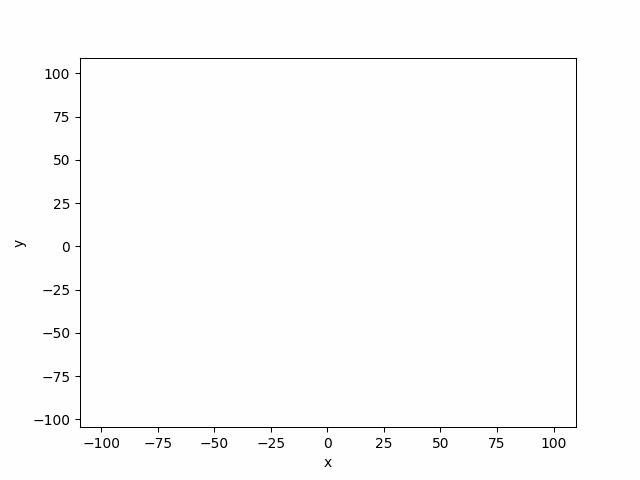
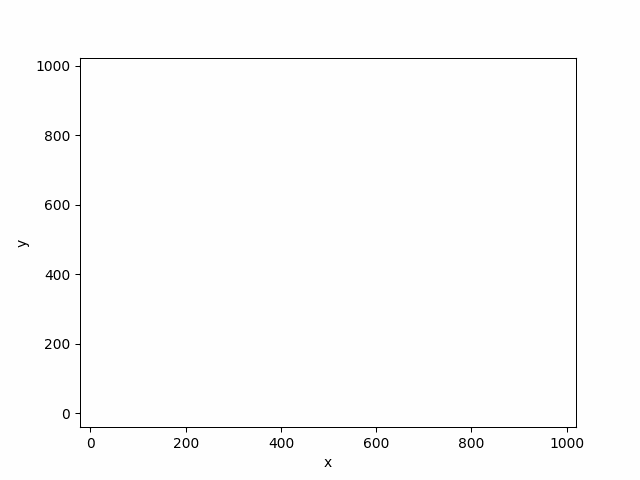

# Computational Geometry 📐
## Computer Science | AGH 2024/2025

## Project Description

This repository provides implementations of algorithms from the Computational Geometry course at AGH University of Krakow. The focus is on basic geometric algorithms and data structures.

Laboratory resources, including template notebooks, a visualizer, and tests, are provided by the [_BIT Scientific Group_](https://github.com/aghbit/Algorytmy-Geometryczne). No other dependencies than those specified in the _requirements_ file are needed.



## Table of Contents

| Laboratory      | Description                                      | Score | Source |
|-----------------|--------------------------------------------------|-------|--------|
| **Lab 1**       | Geometric Predicates                             | 19/20 | [Lab1](labs/lab1) |
| **Lab 2**       | Convex Hull - Graham and Jarvis Algorithms       | 19/20 | [Lab2](labs/lab2) |
| **Lab 3**       | Monotonic Polygon Triangulation                  | 19/20 | [Lab3](labs/lab3) |
| **Lab 4**       | Line Intersection - Sweep Line Algorithm         | 18/20 | [Lab4](labs/lab4) |
| **Project**     | Orthogonal Range Searching - KD-Tree and QuadTree | 38/40 | [Project Repository](https://github.com/OlaszPL/KDTree_QuadTree_project) |

---

## Prerequisites
- Python 3.12 or later
- `pip` (Python package installer)

## Setup Instructions

### 1. Clone the Repository
Run the following command to clone the project:
```bash
git clone https://github.com/OlaszPL/Computational_geometry_2024.git
cd Computational_geometry_2024
```

### 2. Install Dependencies
Use `pip` to install all dependencies:
```bash
pip install -r requirements.txt
```

## Running the Project

### Executing Jupyter Notebooks
1. Start the Jupyter Notebook server:
   ```bash
   jupyter notebook
   ```
2. Navigate to the labs directory and open the notebook you want to work with, such as labs/lab1/main.ipynb, in your preferred environment (e.g., VS Code or a web browser).

---

## License
This project is licensed under the MIT License. See the [LICENSE](LICENSE) file for details.


